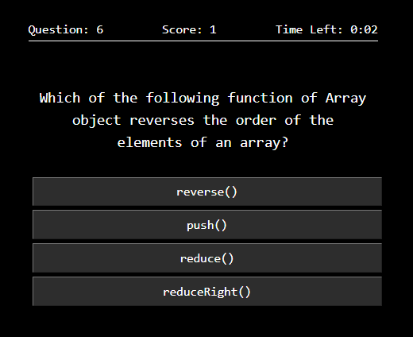
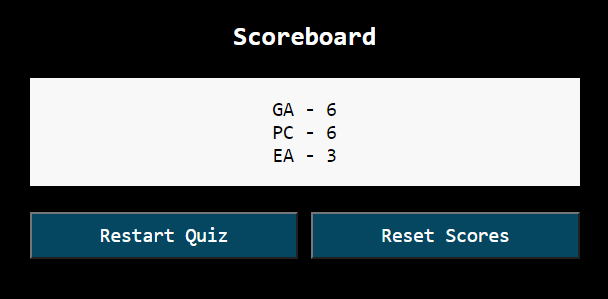

# Timed Code Quiz

Built using HTML, CSS, and plain Javascript.

- A timed quiz on Javascript fundamentals.
- Users have 2 minutes to answer all 10 questions.
- For each incorrect answer, 25 seconds will be deducted from the timer.
- The quiz ends when the timer reaches 0.

<b>Link to app:</b> [Timed Code Quiz](https://nvsco-10.github.io/timed-code-quiz/)

 

 

## Other Features
 

### Scores stored using localStorage

- After the quiz ends, user will be asked to input initials.
The user's initials and score will then be saved into localStorage.

- User will then be taken to the scoreboard page which will display existing scores - from highest to lowest.

- User will be given the option to restart the quiz or reset scores.

- If user resets scores, localStorage will be cleared.
 
 

## License 

This code is licensed under the MIT License.

## Contributions

--------------